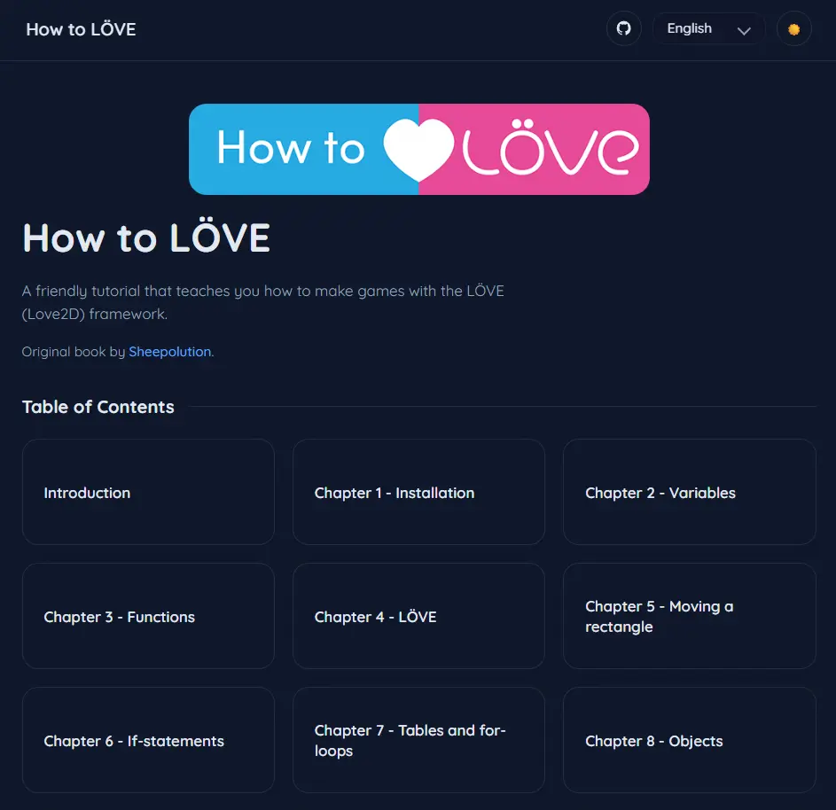

# mdbook-multilang-site

📚 A static website template for multilingual books powered by Markdown.  
只需编写 Markdown，就能发布支持多语言的在线书籍网站。

---

## ✨ Features
- Write your book in **Markdown**
- Built-in **multi-language** support (`en`, `zh-cn`, `zh-tw`, …)
- Ready-to-use **static site** (no backend required)
- Customizable theme, logo, and assets

---

## 🚀 Quick Start
1. Clone this repo  
   ```bash
   git clone https://github.com/cholf5/mdbook-multilang-site.git
   cd mdbook-multilang-site
    ```

2. Edit your book in the `book/` folder

   * `book/en/` → English chapters
   * `book/zh-cn/` → 简体中文章节
   * `book/zh-tw/` → 繁體中文章节

3. Update `book/chapters.json` to configure chapter order.

4. Open `index.html` in your browser 🚀

---

## 🛠 Customization

* Change site title in `index.html`
* Replace `images/logo-banner.png` with your own logo
* Modify styles in `assets/styles.css`

---

## 📖 Example

👉 [Live Demo](https://cholf5.com/how-to-love/)
👉 Screenshot:


---

## 📜 License

MIT License
